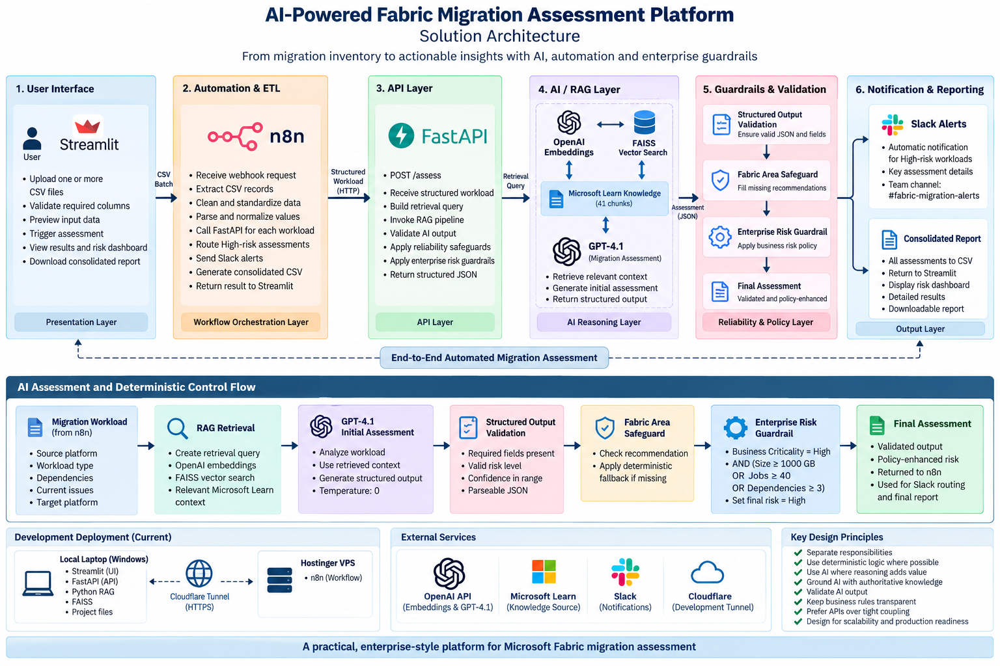

# AI-Powered Fabric Migration Assessment Platform

An enterprise-style GenAI platform for assessing migration workloads targeting **Microsoft Fabric**.

The solution combines **multi-file inventory processing, n8n ETL and workflow automation, FastAPI, Retrieval-Augmented Generation (RAG), FAISS, OpenAI embeddings, GPT-4.1, deterministic enterprise guardrails, Slack escalation, and Streamlit reporting**.



---

## What This Project Demonstrates

```text
Migration Inventory CSVs
        ↓
Streamlit
        ↓
n8n ETL & Automation
        ↓
FastAPI
        ↓
RAG + FAISS + GPT-4.1
        ↓
Validation & Enterprise Guardrails
        ↓
Risk-Based Slack Escalation
        ↓
Assessment Dashboard & Report
```

The platform is designed as a:

> **Human-triggered, end-to-end automated AI migration assessment workflow.**

---

## Key Capabilities

- Multi-file migration inventory upload
- Schema validation and batch consolidation
- n8n-based ETL and data standardization
- FastAPI migration assessment service
- Microsoft Learn-grounded RAG
- OpenAI embeddings with FAISS semantic retrieval
- GPT-4.1 migration reasoning
- Structured AI output validation
- Deterministic Fabric-area reliability safeguard
- Enterprise risk guardrail
- Automated High-risk Slack escalation
- Streamlit assessment dashboard
- Consolidated CSV assessment report
- Human-review flagging

---

## Technology Stack

| Area | Technology |
|---|---|
| User Interface | Streamlit |
| Data Processing | Pandas |
| Workflow & ETL | n8n |
| API | FastAPI, Pydantic, Uvicorn |
| RAG Framework | LangChain |
| Embeddings | OpenAI `text-embedding-3-small` |
| Vector Store | FAISS |
| AI Model | GPT-4.1 |
| Knowledge | Microsoft Learn |
| Web Ingestion | requests, BeautifulSoup |
| Notifications | Slack |
| Development Connectivity | Cloudflare Tunnel |

---

## Documentation

Detailed implementation and learning documentation is organized by topic.

### [Project Overview](docs/project-overview.md)

Project objective, scope, use case and overall solution summary.

### [01 – Environment Setup](docs/01-environment-setup.md)

Python environment, virtual environment, dependencies, Git, n8n and development setup.

### [02 – Solution Architecture](docs/02-architecture.md)

Complete solution architecture, component responsibilities, AI vs deterministic processing, deployment model and design decisions.

### [03 – Data and ETL Design](docs/03-data-and-etl.md)

Migration inventory schema, multi-file processing, deliberately inconsistent input data, n8n ETL, normalization and API data contracts.

### [04 – RAG Pipeline](docs/04-rag-pipeline.md)

Microsoft Learn ingestion, cleaning, chunking, OpenAI embeddings, FAISS, retrieval, GPT-4.1 assessment, validation and enterprise safeguards.

### [05 – API Automation](docs/05-api-automation.md)

FastAPI implementation, `/assess` API, Pydantic validation, RAG integration, n8n connectivity and Cloudflare development tunnel.

### [06 – n8n Workflow](docs/06-n8n-workflow.md)

Webhook processing, CSV extraction, JavaScript ETL, FastAPI integration, risk routing, Slack alerts and report generation.

### [07 – Testing and Results](docs/07-testing-results.md)

Component tests, integration tests, final 10-workload assessment, Streamlit results, Slack escalation and implementation evidence.

### [08 – Key Learnings](docs/08-key-learnings.md)

Technical and architectural lessons from building the complete GenAI automation platform.

---

## Final Test Result

The final end-to-end test processed:

```text
2 Migration Inventory Files
10 Workloads

6  High Risk
4  Medium Risk
0  Low Risk

10 Human Review Required
6  Automated Slack Escalations
```

See the complete evidence and test history in:

**[Testing and Results →](docs/07-testing-results.md)**

---

## Project Structure

```text
Week3-Capstone-AI-Fabric-Migration/
│
├── app/
│   ├── api.py
│   └── rag/
│
├── data/
│   └── sample/
│
├── knowledge/
│   ├── raw/
│   ├── processed/
│   └── faiss_index/
│
├── n8n/
├── docs/
├── assets/
│   ├── architecture/
│   ├── diagrams/
│   └── screenshots/
│
├── streamlit_app.py
├── requirements.txt
├── .env.example
├── .gitignore
└── README.md
```

---

## Project Scope

The current knowledge base is intentionally focused on selected **Microsoft Fabric migration scenarios**.

The platform demonstrates the architecture and engineering pattern rather than claiming comprehensive migration coverage for every source technology.

Future versions can extend the architecture with specialized assessment engines and knowledge bases for additional migration domains.

---

## Detailed Documentation

Start here:

**[Project Overview →](docs/project-overview.md)**

Then follow the numbered documentation from **01 through 08** for the complete implementation journey.