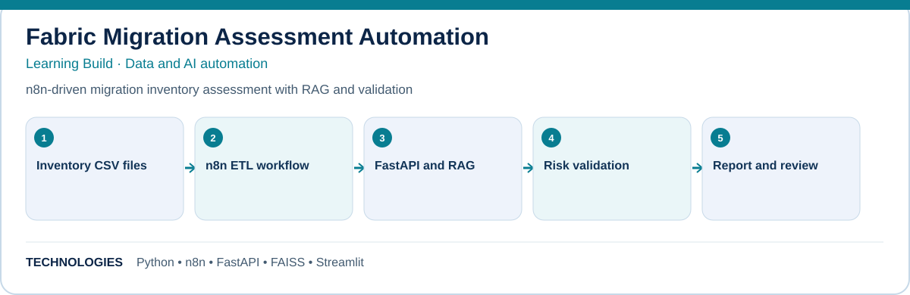

# Fabric Migration Assessment Automation

**Learning Build · Data and AI automation**

n8n-driven migration inventory assessment with RAG and validation.

## What this project explores

- Inventory CSV files
- n8n ETL workflow
- FastAPI and RAG
- Risk validation
- Report and review

## Technology

Python · n8n · FastAPI · FAISS · Streamlit

## Documentation

| Document | Details |
|---|---|
| [01 environment setup](docs/01-environment-setup.md) | Technical reference and project evidence |
| [02 architecture](docs/02-architecture.md) | Technical reference and project evidence |
| [03 data and etl](docs/03-data-and-etl.md) | Technical reference and project evidence |
| [04 rag pipeline](docs/04-rag-pipeline.md) | Technical reference and project evidence |
| [05 api automation](docs/05-api-automation.md) | Technical reference and project evidence |
| [06 n8n workflow](docs/06-n8n-workflow.md) | Technical reference and project evidence |
| [07 testing results](docs/07-testing-results.md) | Technical reference and project evidence |
| [08 key learnings](docs/08-key-learnings.md) | Technical reference and project evidence |
| [PROJECT GUIDE](docs/PROJECT-GUIDE.md) | Original detailed project README |
| [project overview](docs/project-overview.md) | Technical reference and project evidence |

## Scope

This is a learning and engineering portfolio project. See linked documents for implementation, validation, limitations and setup.
