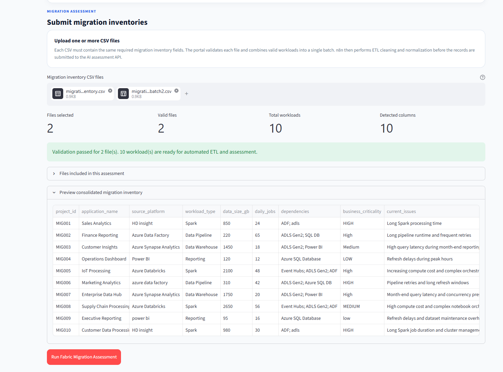

# Data and ETL Design

## 1. Purpose

The Data and ETL layer prepares migration inventory data before it reaches the AI assessment engine.

The final platform supports:

```text
One or More CSV Files
        ↓
Streamlit Validation
        ↓
Multi-File Consolidation
        ↓
n8n Webhook
        ↓
CSV Extraction
        ↓
ETL Cleaning & Standardization
        ↓
Structured Migration Workloads
        ↓
FastAPI Assessment
```

The main design principle is:

> Use deterministic ETL to clean and standardize enterprise data before asking the AI system to reason over it.

---

## 2. Migration Inventory Input Contract

Each migration inventory CSV contains one record per workload.

The required fields are:

| Field | Purpose |
|---|---|
| `project_id` | Unique identifier for the migration workload |
| `application_name` | Application or workload name |
| `source_platform` | Current source technology |
| `workload_type` | Type of workload |
| `data_size_gb` | Approximate data volume in GB |
| `daily_jobs` | Number of jobs or executions per day |
| `dependencies` | Upstream/downstream platform dependencies |
| `business_criticality` | Business importance of the workload |
| `current_issues` | Existing technical or operational problems |
| `target_platform` | Intended migration target |

The final schema therefore contains:

```text
10 required columns
```

---

## 3. Example Input

Example migration inventory:

```csv
project_id,application_name,source_platform,workload_type,data_size_gb,daily_jobs,dependencies,business_criticality,current_issues,target_platform
MIG001,Sales Analytics,HD insight,Spark,850,24,"ADF; adls",HIGH,"Long Spark processing time",Microsoft Fabric
MIG002,Finance Reporting,Azure Data Factory,Data Pipeline,220,65,"ADLS Gen2; SQL DB",High,"Long pipeline runtime and frequent retries",Microsoft Fabric
MIG003,Customer Insights,Azure Synapse Analytics,Data Warehouse,1450,18,"ADLS Gen2; Power BI",Medium,"High query latency during month-end reporting",Microsoft Fabric
```

The dataset intentionally contains some inconsistent values.

This is deliberate because the project is designed to demonstrate an ETL stage rather than sending perfectly cleaned sample data directly to the AI model.

---

## 4. Why the Input Data Is Deliberately Messy

Real enterprise inventory data may come from:

```text
Spreadsheets
CMDB exports
Application inventories
Cloud discovery tools
Manual assessments
Different engineering teams
```

These sources may represent the same technology differently.

Examples:

```text
HD insight
HDInsight

azure data factory
Azure Data Factory

power bi
Power BI

HIGH
High
high

ADF; adls
ADF; ADLS Gen2
```

The project deliberately reproduces this problem in a controlled dataset.

This allows the workflow to demonstrate:

```text
Raw Data
   ↓
ETL
   ↓
Standardized Data
   ↓
AI
```

rather than:

```text
Perfect Data
   ↓
AI
```

---

## 5. Multi-File Input

The final Streamlit application supports multiple migration inventory CSV files.



*Figure: Streamlit validates and consolidates two migration inventory CSV files containing 10 workloads. The preview intentionally shows inconsistent source-platform and business-criticality values before n8n ETL cleaning and normalization.*

Example:

```text
migration_inventory.csv
        +
migration_inventory_batch2.csv
        ↓
Streamlit
        ↓
Validation
        ↓
Consolidation
```

The final end-to-end demonstration used:

```text
Files Selected:      2
Valid Files:         2
Total Workloads:    10
Required Columns:   10
```

Both files followed the same migration inventory contract.

---

## 6. Streamlit Validation

Before the data is sent to n8n, Streamlit checks that each uploaded file contains the required columns.

The expected columns are:

```text
project_id
application_name
source_platform
workload_type
data_size_gb
daily_jobs
dependencies
business_criticality
current_issues
target_platform
```

Files that do not satisfy the required schema should not proceed into the assessment workflow.

This provides an early validation boundary:

```text
Uploaded CSV
     ↓
Schema Valid?
  ↙          ↘
No           Yes
↓             ↓
Reject     Continue
```

---

## 7. Streamlit Multi-File Consolidation

After validation, Streamlit combines all valid files into one in-memory dataset.

Example:

```text
CSV File 1
5 workloads

CSV File 2
5 workloads
      ↓
Consolidation
      ↓
10 workloads
```

The consolidated dataset is then converted into a CSV payload and sent to the n8n webhook.

This design keeps:

```text
File Management
→ Streamlit

ETL & Workflow Processing
→ n8n
```

---

## 8. Why Consolidation Happens Before n8n

Streamlit already owns the file-upload interface.

It is therefore the natural location to handle:

```text
Multiple file selection
File validation
File-level error messages
Dataset preview
File consolidation
```

n8n can then focus on:

```text
CSV extraction
Record parsing
Data cleaning
Standardization
API orchestration
Decision routing
```

This creates a clearer separation of responsibilities.

---

## 9. n8n Webhook Input

The consolidated CSV is sent from Streamlit to the published n8n webhook.

Conceptually:

```text
Streamlit
    ↓
HTTP POST
    ↓
CSV Binary Payload
    ↓
n8n Webhook
```

The uploaded file is received by n8n as binary data.

During development, the binary property was observed as:

```text
file0
```

The Extract from File node is configured to read this property.

---

## 10. CSV Extraction

The n8n Extract from File node converts the uploaded binary CSV into records for downstream processing.

During implementation, the extracted CSV rows appeared in an unexpected form where an entire CSV row could appear as one comma-delimited field.

Instead of redesigning the workflow, the Code node was made robust enough to parse this input.

The parser also handles quoted CSV values so that commas within quoted fields do not incorrectly split columns.

Conceptually:

```text
Binary CSV
    ↓
Extract from File
    ↓
Raw Row Representation
    ↓
Code Parser
    ↓
Structured Record
```

---

## 11. ETL Responsibilities

The n8n Code node performs the main Transform stage.

Its responsibilities include:

```text
Parse CSV row
Map fields
Trim values
Standardize source platform
Normalize business criticality
Normalize dependencies
Convert numeric fields
Produce structured API payload
```

This stage prepares each workload for FastAPI.

---

## 12. Source Platform Standardization

Different spellings and casing are normalized.

Examples:

```text
HD insight
    ↓
HDInsight
```

```text
azure data factory
    ↓
Azure Data Factory
```

```text
power bi
    ↓
Power BI
```

This gives the downstream assessment engine more consistent platform names.

---

## 13. Business Criticality Normalization

Business criticality is standardized to:

```text
High
Medium
Low
```

Examples:

```text
HIGH
high
High
    ↓
High
```

```text
MEDIUM
medium
Medium
    ↓
Medium
```

```text
LOW
low
Low
    ↓
Low
```

This is especially important because business criticality is later used by the enterprise risk guardrail.

---

## 14. Dependency Normalization

Raw dependencies may arrive as delimited text.

Example:

```text
ADF; adls
```

The ETL process converts this into a structured list.

Example:

```json
[
  "ADF",
  "ADLS"
]
```

Another input:

```text
Event Hubs; ADLS Gen2; ADF
```

becomes a structured dependency collection that FastAPI can consume.

This is important because dependency count is also used by the deterministic enterprise risk guardrail.

---

## 15. Numeric Type Conversion

CSV values may initially be interpreted as strings.

The ETL layer explicitly prepares numeric values for:

```text
data_size_gb
daily_jobs
```

Conceptually:

```text
"850"
  ↓
850

"24"
  ↓
24
```

The FastAPI contract expects:

```text
data_size_gb → numeric
daily_jobs   → integer
```

---

## 16. Example Raw Record

Before ETL:

```json
{
  "project_id": "MIG001",
  "application_name": "Sales Analytics",
  "source_platform": "HD insight",
  "workload_type": "Spark",
  "data_size_gb": "850",
  "daily_jobs": "24",
  "dependencies": "ADF; adls",
  "business_criticality": "HIGH",
  "current_issues": "Long Spark processing time",
  "target_platform": "Microsoft Fabric"
}
```

---

## 17. Example Clean Record

After n8n ETL:

```json
{
  "project_id": "MIG001",
  "application_name": "Sales Analytics",
  "source_platform": "HDInsight",
  "workload_type": "Spark",
  "data_size_gb": 850,
  "daily_jobs": 24,
  "dependencies": [
    "ADF",
    "ADLS"
  ],
  "business_criticality": "High",
  "current_issues": "Long Spark processing time",
  "target_platform": "Microsoft Fabric"
}
```

This is the record sent to FastAPI.

---

## 18. ETL Data Flow

The complete ETL path is:

```text
Raw CSV Files
     ↓
Streamlit
     ↓
Schema Validation
     ↓
Multi-File Consolidation
     ↓
n8n Webhook
     ↓
Extract from File
     ↓
CSV Parsing
     ↓
Source Platform Normalization
     ↓
Criticality Normalization
     ↓
Dependency Normalization
     ↓
Numeric Type Conversion
     ↓
Clean Structured Workload
     ↓
FastAPI /assess
```

---

## 19. ETL vs AI Responsibilities

A key design decision is determining what should be handled by deterministic ETL and what should be handled by AI.

### ETL Handles

```text
Casing
Known platform-name normalization
String cleanup
Dependency parsing
Numeric conversion
Schema preparation
```

### AI Handles

```text
Migration reasoning
Risk identification
Migration considerations
Fabric-area recommendation
Explanation of the assessment
```

This follows the principle:

> Do deterministic work deterministically and use AI where reasoning adds value.

---

## 20. FastAPI Input Contract

After ETL, each migration workload is sent to:

```text
POST /assess
```

Expected structure:

```json
{
  "project_id": "MIG001",
  "application_name": "Sales Analytics",
  "source_platform": "HDInsight",
  "workload_type": "Spark",
  "data_size_gb": 850,
  "daily_jobs": 24,
  "dependencies": [
    "ADF",
    "ADLS"
  ],
  "business_criticality": "High",
  "current_issues": "Long Spark processing time",
  "target_platform": "Microsoft Fabric"
}
```

FastAPI uses Pydantic to enforce the expected request structure.

---

## 21. Assessment Output Contract

The assessment API returns structured JSON containing:

```text
project_id
recommended_fabric_area
risk_level
confidence
key_risks
migration_considerations
human_review_required
reason
sources_used
```

Example:

```json
{
  "project_id": "MIG001",
  "recommended_fabric_area": "Data Engineering (Lakehouse, Notebooks, Spark Job Definitions, Pipelines)",
  "risk_level": "High",
  "confidence": 0.5,
  "key_risks": [
    "Migration requires detailed Spark workload compatibility review"
  ],
  "migration_considerations": [
    "Review Spark job dependencies and orchestration requirements"
  ],
  "human_review_required": true,
  "reason": "Assessment based on retrieved migration guidance and enterprise risk policy.",
  "sources_used": [
    "Synapse Spark Migration"
  ]
}
```

The exact generated assessment can vary because the LLM performs probabilistic reasoning.

---

## 22. Why Structured Output Matters

n8n must make deterministic workflow decisions after receiving the AI assessment.

For example:

```text
risk_level == High
```

can be directly evaluated by an IF node.

This would be much harder if GPT returned only free-form text such as:

```text
"This workload appears to present substantial migration risk..."
```

The architecture therefore follows:

```text
AI Reasoning
     ↓
Structured JSON
     ↓
Validation
     ↓
Workflow Automation
```

---

## 23. Data Used by the Enterprise Risk Guardrail

After the AI generates its initial assessment, deterministic risk policy also evaluates workload attributes.

Current rule:

```text
Business Criticality = High

AND at least one:

Data Size >= 1000 GB
OR
Daily Jobs >= 40
OR
Dependencies >= 3

        ↓

Final Risk = High
```

This demonstrates why ETL quality matters.

For example:

```text
HIGH
```

must reliably become:

```text
High
```

and:

```text
ADF; ADLS Gen2; Event Hubs
```

must become three structured dependencies.

Otherwise deterministic business policy could produce incorrect results.

---

## 24. Data Quality and AI Quality

The project reinforced the relationship:

```text
Input Data Quality
        ↓
Retrieval Query Quality
        ↓
AI Assessment Quality
        ↓
Automation Reliability
```

Poorly structured input can affect:

```text
RAG retrieval
AI reasoning
Risk policy
Downstream routing
```

Therefore, ETL is not separate from AI quality.

It directly contributes to the reliability of the complete AI workflow.

---

## 25. Final Demo Dataset

The final end-to-end demonstration used two CSV files.

Combined workload IDs:

```text
MIG001
MIG002
MIG003
MIG004
MIG005
MIG006
MIG007
MIG008
MIG009
MIG010
```

Combined:

```text
2 Files
10 Workloads
10 Required Columns
```

The data intentionally included different:

```text
Source platforms
Workload types
Data sizes
Job counts
Dependencies
Criticality levels
Current issues
```

This provided a more realistic batch assessment than repeatedly testing a single workload.

---

## 26. Final End-to-End Data Result

The two files were:

```text
Uploaded
   ↓
Validated
   ↓
Consolidated
   ↓
Submitted to n8n
   ↓
Extracted
   ↓
ETL Standardized
   ↓
Processed as 10 workloads
   ↓
Assessed through FastAPI
```

The final tested assessment produced:

```text
Total Workloads: 10
High Risk:        6
Medium Risk:      4
Low Risk:         0
Human Review:    10
```

The six final High-risk workloads were automatically routed to Slack.

These classifications represent the **final assessment after AI reasoning and deterministic enterprise guardrails**.

---

## 27. Separation of Data Responsibilities

The final data architecture is:

| Layer | Data Responsibility |
|---|---|
| Streamlit | File validation and consolidation |
| n8n | CSV extraction, ETL and standardization |
| FastAPI | Request contract and assessment orchestration |
| Embedding Model | Retrieval-query vectorization |
| FAISS | Knowledge retrieval |
| GPT-4.1 | Migration reasoning |
| Validation | Assessment contract enforcement |
| Risk Guardrail | Deterministic risk policy |
| n8n | Final workflow routing |
| Streamlit | Assessment presentation and download |

---

## 28. Data Flow Summary

```text
Migration Inventory Files
        ↓
Streamlit
        ↓
Validate
        ↓
Consolidate
        ↓
n8n Webhook
        ↓
Extract CSV
        ↓
Parse
        ↓
Clean
        ↓
Normalize
        ↓
Convert Types
        ↓
Structured Workloads
        ↓
FastAPI
        ↓
RAG + GPT
        ↓
Validated Assessment
        ↓
Enterprise Guardrails
        ↓
Final Assessment
        ↓
n8n Routing
        ↓
Consolidated Report
        ↓
Streamlit
```

---

## 29. Key Data and ETL Learnings

1. Enterprise input data should not be assumed to be clean.
2. Schema validation should happen before expensive AI processing.
3. Multiple input files can be consolidated before workflow processing.
4. Deterministic ETL should handle predictable data-cleaning problems.
5. LLMs should not be used simply to fix casing or parse known delimiters.
6. Structured data improves API reliability.
7. Structured dependencies enable deterministic downstream rules.
8. Data quality directly affects retrieval and AI quality.
9. AI output should also follow a structured contract.
10. ETL and AI are complementary parts of the same enterprise workflow.

---

## 30. Final Status

```text
Input Contract                     COMPLETE
10-Column Schema                   COMPLETE
Multi-File Upload                  COMPLETE
Schema Validation                  COMPLETE
Multi-File Consolidation           COMPLETE
Webhook CSV Transfer               COMPLETE
CSV Extraction                     COMPLETE
CSV Parsing                        COMPLETE
Source Platform Normalization      COMPLETE
Criticality Normalization          COMPLETE
Dependency Normalization           COMPLETE
Numeric Type Conversion            COMPLETE
FastAPI Input Contract             COMPLETE
Structured Assessment Output       COMPLETE
10-Workload Batch Test             COMPLETE
```

The final data pipeline successfully transforms deliberately inconsistent migration inventory data into structured records suitable for RAG-based AI assessment and deterministic enterprise automation.