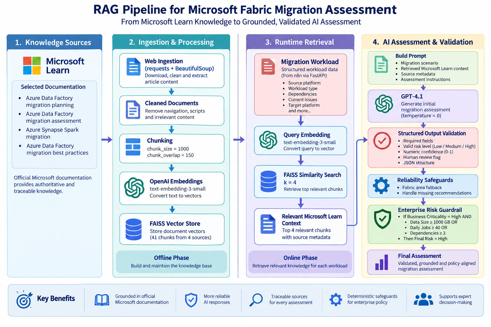

# RAG Pipeline

## 1. Purpose

The Retrieval-Augmented Generation (RAG) component provides grounded technical context for Microsoft Fabric migration assessments.

Instead of relying only on GPT-4.1's general knowledge, the application retrieves relevant information from curated Microsoft Learn documentation and supplies that evidence to the model together with the migration workload.

The complete RAG flow is:

```text
Official Microsoft Learn Documentation
                ↓
           Web Ingestion
                ↓
        Cleaned Documents
                ↓
             Chunking
                ↓
       OpenAI Embeddings
                ↓
        FAISS Vector Store
                ↓
                │
Migration       │
Workload ───────┘
    ↓
Retrieval Query
    ↓
Query Embedding
    ↓
FAISS Similarity Search
    ↓
Relevant Microsoft Learn Chunks
    +
Original Migration Workload
    ↓
GPT-4.1
    ↓
Initial Structured Assessment
    ↓
Validation
    ↓
Reliability Safeguards
    ↓
Enterprise Risk Guardrail
    ↓
Final Assessment
```

---

## 2. RAG Architecture



*Figure: RAG pipeline showing Microsoft Learn knowledge ingestion, chunking and embeddings, FAISS retrieval, GPT-4.1 assessment, structured validation, reliability safeguards, and deterministic enterprise risk policy.*

The RAG implementation has two distinct phases:

```text
PHASE 1
Knowledge Preparation

Microsoft Learn
      ↓
Ingestion
      ↓
Cleaning
      ↓
Chunking
      ↓
Embeddings
      ↓
FAISS
```

and:

```text
PHASE 2
Runtime Assessment

Migration Workload
      ↓
Retrieval Query
      ↓
Query Embedding
      ↓
FAISS Retrieval
      ↓
Relevant Context
      ↓
GPT-4.1
      ↓
Assessment
```

This distinction is important.

Documents are embedded when the knowledge base is built.

The migration workload is embedded at runtime only for the purpose of finding relevant knowledge.

---

## 3. Knowledge Source Strategy

The project intentionally uses a small curated knowledge base rather than ingesting the entire Microsoft Fabric documentation library.

The current knowledge base focuses on:

```text
Azure Data Factory migration planning
Azure Data Factory migration assessment
Azure Synapse Spark migration
Azure Data Factory migration best practices
```

Only official Microsoft Learn documentation is used.

This improves:

```text
Source authority
Traceability
Explainability
Human verification
```

The current knowledge base is deliberately limited in scope and should not be treated as comprehensive guidance for every possible migration platform.

---

## 4. Knowledge Sources

The four knowledge sources used are:

```text
ADF Migration Planning

ADF Migration Assessment

Synapse Spark Migration Overview

ADF / Fabric Data Factory Migration Best Practices
```

The source URLs are maintained in:

```text
app/rag/ingest_web.py
```

The source definitions are also documented under:

```text
knowledge/raw/source_list.md
```

---

## 5. Knowledge Folder Structure

```text
knowledge/
├── raw/
│   └── source_list.md
│
├── processed/
│   ├── adf_migration_planning.txt
│   ├── adf_migration_assessment.txt
│   ├── synapse_spark_migration.txt
│   └── adf_migration_best_practices.txt
│
└── faiss_index/
```

### `raw`

Contains source definitions and references.

### `processed`

Contains cleaned text extracted from Microsoft Learn.

### `faiss_index`

Contains the persisted FAISS vector index used during runtime retrieval.

---

## 6. Web Ingestion

The ingestion implementation is:

```text
app/rag/ingest_web.py
```

The main libraries used are:

```text
requests
BeautifulSoup
```

The ingestion flow is:

```text
Microsoft Learn URL
        ↓
requests.get()
        ↓
HTML
        ↓
BeautifulSoup
        ↓
Locate Main Article
        ↓
Remove Irrelevant HTML
        ↓
Extract Readable Text
        ↓
Preserve Metadata
        ↓
Save Processed Text File
```

---

## 7. Why Web Ingestion Is Required

The vector database should not be built directly from uncontrolled webpage HTML.

Raw webpages may contain:

```text
Navigation
Menus
Scripts
Cookie content
Headers
Footers
Unrelated website elements
```

The ingestion stage converts the webpage into a cleaner knowledge representation before chunking.

The principle is:

```text
Trusted Source
      ↓
Clean Knowledge
      ↓
Vectorization
```

---

## 8. Metadata Preservation

Each processed document retains metadata such as:

```text
TITLE
SOURCE_URL
SOURCE_TYPE
```

Example structure:

```text
TITLE: Microsoft Learn article title
SOURCE_URL: Microsoft Learn source
SOURCE_TYPE: Microsoft Learn
```

Metadata allows the assessment pipeline to identify which sources contributed to the retrieved context.

This improves:

```text
Traceability
Explainability
Source reporting
Human validation
```

---

## 9. Initial Ingestion Test

The ingestion script was executed using:

```cmd
python app\rag\ingest_web.py
```

During the first attempt, two Microsoft Learn URLs returned:

```text
HTTP 404
```

The scraper itself was functioning correctly.

The source URLs had changed.

After updating the URLs, all four sources were successfully processed.

Final result:

```text
ADF Migration Planning           SUCCESS
ADF Migration Assessment         SUCCESS
Synapse Spark Migration          SUCCESS
ADF Migration Best Practices     SUCCESS
```

Approximate final extracted sizes were:

```text
ADF Migration Planning          12,122 characters
ADF Migration Assessment         3,854 characters
Synapse Spark Migration          4,992 characters
ADF Migration Best Practices     8,332 characters
```

---

## 10. Source Maintenance Learning

The 404 issue demonstrated an important production consideration.

External documentation URLs can change.

A production RAG knowledge pipeline should therefore include:

```text
Source availability checks
Ingestion validation
Failure logging
Content validation
Source maintenance
Scheduled refresh where appropriate
```

A RAG knowledge base should not assume that external sources remain permanently unchanged.

---

## 11. Encoding Issue and Resolution

During early ingestion and retrieval testing, some special characters were displayed incorrectly.

For example:

```text
donât
```

appeared instead of:

```text
don’t
```

The issue originated from webpage character encoding.

The ingestion logic was updated to apply the detected response encoding before BeautifulSoup processed the content.

After rebuilding the documents and FAISS index, the retrieved text displayed correctly.

This demonstrated:

```text
Poor Source Encoding
        ↓
Poor Stored Knowledge
        ↓
Poor Retrieved Context
        ↓
Potentially Poorer AI Output
```

Data quality problems should therefore be corrected before the content reaches the LLM.

---

## 12. Content Validation

Processed files were manually inspected before vectorization.

Validation confirmed that the files contained:

```text
Article title
Source URL
Source type
Readable technical content
```

and were not dominated by:

```text
Navigation menus
Cookie notices
Script content
Website chrome
Unrelated page elements
```

Only after this validation was the content moved to the vectorization stage.

---

## 13. RAG Does Not Start With Embeddings

An important learning from this project is:

> RAG begins with knowledge quality, not with vectorization.

The correct order is:

```text
Source Selection
      ↓
Ingestion
      ↓
Cleaning
      ↓
Validation
      ↓
Chunking
      ↓
Embeddings
      ↓
Vector Storage
```

Creating embeddings from poor-quality source content would only create a searchable poor-quality knowledge base.

---

## 14. Chunking

Vector-store creation is implemented in:

```text
app/rag/build_vector_store.py
```

The processed documents are split using recursive text splitting.

Configuration:

```text
chunk_size = 1000
chunk_overlap = 150
```

The four Microsoft Learn documents produced:

```text
41 chunks
```

---

## 15. Why Chunking Is Required

Embedding an entire large document as one vector would make retrieval too broad.

Instead:

```text
Document
   ↓
Chunk 1
Chunk 2
Chunk 3
...
```

Each chunk receives its own vector.

This allows FAISS to retrieve only the portions of documentation most relevant to the migration workload.

---

## 16. Why Chunk Overlap Is Used

The project uses:

```text
chunk_overlap = 150
```

Suppose an important explanation begins near the end of one chunk and continues into the next.

Without overlap:

```text
Chunk 1 | Chunk 2
```

the meaning could be split.

With overlap:

```text
Chunk 1
     ↘ shared context
       Chunk 2
```

some surrounding context is retained.

---

## 17. OpenAI Embeddings

The embedding model used is:

```text
text-embedding-3-small
```

The embedding model converts text into a numerical vector representing semantic meaning.

At knowledge-build time:

```text
Document Chunk
      ↓
text-embedding-3-small
      ↓
Vector
      ↓
FAISS
```

The embedding model does **not** generate migration recommendations.

Its role is retrieval.

---

## 18. FAISS Vector Store

FAISS is used as the local vector database.

The index is stored at:

```text
knowledge/faiss_index/
```

Conceptually:

```text
Chunk 1 → Vector 1
Chunk 2 → Vector 2
Chunk 3 → Vector 3
...
              ↓
            FAISS
```

FAISS allows the application to compare a runtime query vector with stored knowledge vectors.

---

## 19. Initial Retrieval Validation

Retrieval testing is implemented in:

```text
app/rag/test_retrieval.py
```

A validation question included:

```text
What should be considered when migrating Azure Data Factory workloads
to Microsoft Fabric?
```

Relevant results were retrieved from documents including:

```text
adf_migration_best_practices.txt
adf_migration_planning.txt
```

The retrieved content included guidance related to:

```text
Mapping Data Flow migration
Dataflow Gen2
Fabric Warehouse
Spark notebooks
Pipeline compatibility
Migration paths
Architectural differences
Manual migration considerations
```

This confirmed that semantic retrieval was working.

---

## 20. Runtime Retrieval Query

In the final application, the retrieval process is initiated from the migration workload rather than a manually typed test question.

FastAPI creates a retrieval query using fields such as:

```text
Source platform
Workload type
Dependencies
Current issues
Target platform
```

Example conceptually:

```text
Assess migration of this workload to Microsoft Fabric:

Source platform: HDInsight
Workload type: Spark
Dependencies: ADF, ADLS
Current issues: Long Spark processing time
Target platform: Microsoft Fabric
```

---

## 21. Query Embedding

The runtime retrieval query is sent to:

```text
text-embedding-3-small
```

This creates a query vector.

```text
Migration Retrieval Query
        ↓
Embedding Model
        ↓
Query Vector
```

That query vector is compared with the vectors already stored in FAISS.

---

## 22. Runtime FAISS Retrieval

The final FastAPI assessment uses:

```text
k = 4
```

FAISS therefore retrieves up to four relevant knowledge chunks for each workload assessment.

Conceptually:

```text
Query Vector
      ↓
FAISS
      ↓
Top Relevant Chunks
      ↓
Retrieved Context
```

This retrieved context is then supplied to GPT-4.1.

---

## 23. Relationship Between Embeddings, FAISS and GPT

These three components have different responsibilities.

```text
OpenAI Embeddings
→ Convert text into vectors

FAISS
→ Compare vectors and retrieve relevant knowledge

GPT-4.1
→ Reason over the retrieved knowledge
```

GPT-4.1 does not directly query FAISS.

The Python application performs retrieval first and then constructs the GPT prompt.

---

## 24. How GPT Receives the Retrieved Chunks

The Python application combines:

```text
Original Migration Scenario
        +
Retrieved Microsoft Learn Context
        +
Source Metadata
        +
Assessment Instructions
```

This combined information becomes the prompt sent to GPT-4.1.

Therefore:

```text
FAISS
  ↓
Relevant Chunks
  ↓
Python
  ↓
Build Prompt
  ↓
GPT-4.1
```

This is the core relationship between retrieval and generation.

---

## 25. Grounded Migration Assessment

The assessment implementation is located in:

```text
app/rag/generate_assessment.py
```

The final flow is:

```text
Migration Scenario
        ↓
Build Retrieval Query
        ↓
OpenAI Embedding
        ↓
FAISS Similarity Search
        ↓
Relevant Microsoft Learn Context
        ↓
Context + Original Scenario
        ↓
GPT-4.1
        ↓
Initial Structured Assessment
```

---

## 26. Why the Original Workload Is Still Required

The retrieved chunks do not replace the original migration scenario.

For example, the retrieved documentation may explain:

```text
Spark migration considerations
```

but GPT still needs to know:

```text
Which application?
How much data?
How many jobs?
What dependencies?
What business criticality?
What current problems?
```

Therefore:

```text
Retrieved Context
        +
Original Workload
        ↓
GPT-4.1
```

Both are required.

---

## 27. GPT-4.1 Configuration

The assessment model is:

```text
gpt-4.1
```

Configuration:

```text
temperature = 0
```

Temperature 0 is used to improve consistency.

However:

> Temperature 0 does not make an LLM fully deterministic.

This became an important practical learning later in the project.

---

## 28. Initial Assessment Test

The first assessment used:

```text
Project: MIG001

Source Platform: HDInsight
Workload Type: Spark
Data Size: 850 GB
Daily Jobs: 24
Dependencies: ADF, ADLS
Business Criticality: High
Current Issue: Long Spark processing time
Target Platform: Microsoft Fabric
```

FAISS retrieved relevant content from:

```text
synapse_spark_migration.txt
```

An early assessment returned approximately:

```text
Recommended Fabric Area:
Data Engineering
(Lakehouse, Notebooks, Spark Job Definitions, Pipelines)

Risk Level:
Medium

Confidence:
0.7

Human Review Required:
True
```

---

## 29. Evidence Gap Observed

The MIG001 test exposed an important limitation.

The retrieved documentation was related to:

```text
Synapse Spark migration
```

while the source platform was:

```text
HDInsight
```

The model acknowledged that the available evidence was not fully HDInsight-specific.

This was useful because it demonstrated that:

```text
Semantically Related Evidence
```

does not automatically mean:

```text
Exact Platform Coverage
```

The knowledge base therefore has explicit scope limitations.

---

## 30. Structured Assessment Contract

GPT-4.1 is instructed to return structured JSON containing:

```text
project_id
recommended_fabric_area
risk_level
confidence
key_risks
migration_considerations
human_review_required
reason
sources_used
```

This structured format allows FastAPI and n8n to consume individual assessment fields.

For example:

```text
risk_level = High
```

can be evaluated by n8n.

---

## 31. Assessment Validation

Validation is implemented in:

```text
app/rag/validate_assessment.py
```

The response is parsed and checked before downstream use.

Validation includes:

```text
Required fields exist
Risk level is Low / Medium / High
Confidence is numeric
Confidence is between 0 and 1
human_review_required is Boolean
```

Conceptually:

```text
GPT Response
      ↓
JSON Parsing
      ↓
Validation
      ↓
Structured Assessment
```

---

## 32. Why Validation Matters

The prompt requests structured output, but downstream automation should not simply assume that the LLM always follows the contract.

Without validation:

```text
GPT
 ↓
n8n
```

With validation:

```text
GPT
 ↓
Contract Validation
 ↓
n8n
```

This creates a safer automation boundary.

---

## 33. Recommended Fabric Area Safeguard

During repeated testing, GPT occasionally returned a blank or missing:

```text
recommended_fabric_area
```

A deterministic reliability safeguard was added.

The GPT recommendation remains the primary result.

The fallback activates only if the AI-generated recommendation is blank or missing.

Examples:

```text
Reporting / Power BI
→ Power BI
  (Semantic Models, Reports, Dashboards)

Data Warehouse / Synapse Warehouse
→ Data Warehouse
  (Fabric Warehouse, SQL Analytics)

Spark / Databricks / HDInsight
→ Data Engineering
  (Lakehouse, Notebooks, Spark Job Definitions, Pipelines)

ADF / Pipeline / ETL
→ Data Factory
  (Pipelines, Dataflows Gen2)
```

If no specific area can safely be determined:

```text
Microsoft Fabric
(Fabric area requires architecture review)
```

is used.

---

## 34. Why the Fabric Area Safeguard Was Added

The downstream system expects:

```text
recommended_fabric_area
```

to contain a meaningful value.

An incomplete field would reduce:

```text
UI quality
Report completeness
Slack usefulness
Automation reliability
```

The safeguard demonstrates:

```text
AI Output
    ↓
Validate
    ↓
Repair Known Failure Mode
    ↓
Reliable Contract
```

---

## 35. LLM Risk Variability

During repeated end-to-end tests, the same or similar workload could receive different risk classifications.

For example:

```text
Execution 1
→ High

Execution 2
→ Medium
```

This occurred even with:

```text
temperature = 0
```

This demonstrated that an LLM should not be treated as a deterministic enterprise policy engine.

---

## 36. Why This Matters

The risk level controls downstream operational behavior:

```text
Final Risk = High
        ↓
n8n
        ↓
Slack Alert
```

If the workflow depended entirely on variable model classification, operational escalation could become inconsistent.

This led to an architectural improvement.

---

## 37. Enterprise Risk Guardrail

A deterministic enterprise risk guardrail was added after the AI assessment.

Current rule:

```text
Business Criticality = High

AND at least one:

Data Size >= 1000 GB
OR
Daily Jobs >= 40
OR
Dependencies >= 3

        ↓

Final Risk = High
```

If GPT already returns High, the High classification remains.

If GPT returns a lower risk but the enterprise rule is triggered, the final classification is raised to High.

---

## 38. Final Risk Architecture

The final assessment path is:

```text
RAG Context
    +
Migration Scenario
    ↓
GPT-4.1
    ↓
Initial AI Assessment
    ↓
Structured Validation
    ↓
Fabric Area Safeguard
    ↓
Enterprise Risk Guardrail
    ↓
Final Assessment
```

This should be described as:

> AI assessment combined with deterministic enterprise policy.

It should **not** be described as GPT alone determining every final High-risk workload.

---

## 39. AI Reasoning vs Deterministic Policy

The final design deliberately separates these responsibilities.

### GPT-4.1

Handles:

```text
Migration reasoning
Risk identification
Migration considerations
Fabric recommendation
Explanation
Initial risk assessment
```

### Deterministic Logic

Handles:

```text
Structured validation
Fabric-area fallback
Enterprise risk policy
```

### n8n

Handles:

```text
Final risk routing
Slack escalation
```

This provides a clearer enterprise architecture.

---

## 40. Human Review

The assessment contract contains:

```text
human_review_required
```

The final demonstration produced:

```text
Human Review: 10 / 10 workloads
```

This reinforces that the application is an:

```text
AI-Assisted Migration Assessment Platform
```

rather than an autonomous migration decision engine.

The AI supports expert decision-making.

It does not replace migration architects.

---

## 41. Confidence Interpretation

The current:

```text
confidence
```

value is generated by GPT-4.1.

It should **not** be interpreted as a statistically calibrated probability that the recommendation is correct.

For this learning project, confidence is an explanatory signal.

A production confidence model could incorporate:

```text
Exact documentation coverage
Retrieval relevance
Inventory completeness
Compatibility results
Rule outcomes
Conflicting evidence
Source authority
Source freshness
```

A stronger production pattern would therefore combine:

```text
RAG
+
Assessment Tools
+
Rules
+
Validation
+
Human Review
```

---

## 42. RAG Scope Limitation

The current RAG knowledge base contains selected guidance for:

```text
ADF
Synapse Spark
Microsoft Fabric
```

It is not a comprehensive knowledge base for:

```text
Every HDInsight workload
Every Databricks workload
Every Power BI migration
Every Azure migration scenario
```

Therefore, recommendations must be interpreted within the scope of the available evidence.

---

## 43. Why Spotfire → Power BI Is Not Included

The current RAG engine is designed for:

```text
Migration toward Microsoft Fabric
```

A scenario such as:

```text
Spotfire → Power BI
```

would require a different knowledge base and assessment prompt.

A future architecture could use:

```text
Assessment Router
       ↓
 ┌──────────────┬───────────────┐
 ↓              ↓
Fabric RAG   Power BI RAG
```

The current project intentionally avoids pretending that one small RAG index can reliably assess every migration domain.

---

## 44. Final End-to-End RAG Test

The final demonstration processed:

```text
2 CSV Files
10 Workloads
```

Each workload followed:

```text
Clean Migration Workload
        ↓
FastAPI
        ↓
Retrieval Query
        ↓
OpenAI Embedding
        ↓
FAISS
        ↓
Relevant Context
        ↓
GPT-4.1
        ↓
Structured Assessment
        ↓
Validation
        ↓
Reliability Safeguard
        ↓
Enterprise Risk Guardrail
        ↓
Final Assessment
```

The final batch produced:

```text
Total Workloads: 10
High Risk:        6
Medium Risk:      4
Low Risk:         0
Human Review:    10
```

All six final High-risk workloads were subsequently routed by n8n to Slack.

---

## 45. Final RAG Component Status

```text
Knowledge Source Selection        COMPLETE
Official Microsoft Sources        COMPLETE
Web Ingestion                     COMPLETE
Text Cleaning                     COMPLETE
Encoding Correction               COMPLETE
Metadata Preservation             COMPLETE
Content Validation                COMPLETE
Chunking                          COMPLETE
OpenAI Embeddings                 COMPLETE
FAISS Vector Store                COMPLETE
Retrieval Validation              COMPLETE
Runtime Query Embedding           COMPLETE
Runtime FAISS Retrieval           COMPLETE
GPT-4.1 Integration               COMPLETE
Structured Assessment             COMPLETE
Assessment Validation             COMPLETE
Fabric Area Safeguard             COMPLETE
LLM Variability Evaluation        COMPLETE
Enterprise Risk Guardrail         COMPLETE
FastAPI Integration               COMPLETE
10-Workload End-to-End Test       COMPLETE
```

---

## 46. Key RAG Learnings

1. RAG begins with trustworthy knowledge, not embeddings.
2. Poor source content produces poor retrieval.
3. Source metadata improves traceability.
4. Documents should be chunked before vectorization.
5. Chunk overlap helps preserve context across boundaries.
6. Embeddings represent semantic meaning.
7. FAISS performs retrieval; it does not generate answers.
8. GPT does not directly access FAISS.
9. Python retrieves the chunks and supplies them to GPT.
10. The original workload and retrieved context are both required.
11. RAG grounds the model but does not eliminate hallucination.
12. Semantically related documentation may still have platform-coverage gaps.
13. Structured AI output should be validated.
14. Temperature 0 does not make an LLM deterministic.
15. Deterministic safeguards can protect known failure modes.
16. Enterprise business policy should not be hidden inside probabilistic AI reasoning.
17. Human review remains important for consequential migration decisions.
18. A RAG system should not claim expertise beyond its knowledge base.

---

## 47. Final RAG Summary

The final RAG pipeline can be summarized as:

```text
Microsoft Learn
      ↓
Ingestion
      ↓
Cleaning
      ↓
Chunking
      ↓
Embeddings
      ↓
FAISS
      ↓
Relevant Knowledge
      +
Migration Workload
      ↓
GPT-4.1
      ↓
Initial Assessment
      ↓
Validation
      ↓
Reliability Safeguards
      ↓
Enterprise Risk Policy
      ↓
Final Assessment
```

The central learning is that RAG is not simply:

```text
FAISS + GPT
```

It is a complete knowledge and reasoning pipeline involving:

```text
Source Quality
+
Data Preparation
+
Chunking
+
Embeddings
+
Retrieval
+
Prompt Context
+
LLM Reasoning
+
Validation
+
Deterministic Controls
+
Human Review
```

This provides the migration assessment platform with a grounded and more controllable AI reasoning layer.