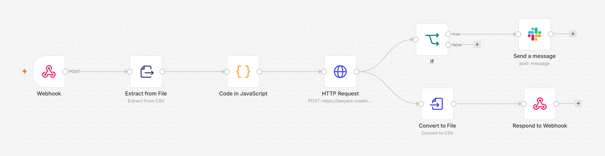

# n8n Workflow Automation

## 1. Purpose

n8n is the workflow orchestration and ETL layer of the AI-Powered Fabric Migration Assessment Platform.

The final solution separates responsibilities across the application:

```text
Streamlit
→ User interface, multi-file upload, validation, consolidation and reporting

n8n
→ Workflow orchestration, ETL cleaning, API calls, decision routing,
  Slack escalation and response generation

FastAPI
→ HTTP interface to the migration assessment intelligence

FAISS + OpenAI Embeddings
→ Retrieval of relevant Microsoft migration guidance

GPT-4.1
→ AI-generated migration assessment

Enterprise Risk Guardrail
→ Deterministic validation of final operational risk

Slack
→ Automatic escalation of High-risk workloads
```

The result is a human-triggered, end-to-end automated AI migration assessment workflow.

Once the user submits migration inventories from the Streamlit application, the remaining processing is automated.

---

## 2. Final End-to-End Workflow

## Final n8n Workflow



*Figure: Final n8n automation flow covering webhook intake, CSV extraction, ETL normalization, FastAPI assessment, High-risk routing to Slack, CSV generation, and webhook response.*

The final workflow is:

```text
User
  ↓
Streamlit UI
  ↓
Upload one or more CSV files
  ↓
Validate schema
  ↓
Consolidate valid CSV files
  ↓
POST consolidated CSV
  ↓
n8n Webhook
  ↓
Extract from File
  ↓
Code - ETL Cleaning & Standardization
  ↓
One structured record per workload
  ↓
HTTP Request
  ↓
FastAPI /assess
  ↓
OpenAI Embeddings
  ↓
FAISS Retrieval
  ↓
Relevant Microsoft Learn Context
  ↓
GPT-4.1 Initial Assessment
  ↓
Structured JSON Validation
  ↓
Fabric Area Reliability Safeguard
  ↓
Enterprise Risk Guardrail
  ↓
Final Assessment
  ↓
n8n IF Node
  ↓
risk_level == High?
  ├── True  → Slack Alert
  └── False → No Slack Alert
  ↓
Convert Assessments to CSV
  ↓
Respond to Webhook
  ↓
Streamlit UI
  ↓
Assessment Register + Detailed Results + Download
```

---

## 3. Webhook Trigger

The final workflow no longer depends on an n8n Manual Trigger for normal application execution.

The Streamlit application calls the published n8n webhook using an HTTP POST request.

Production webhook path:

```text
/webhook/fabric-migration-assessment
```

During development, the webhook test endpoint was also used:

```text
/webhook-test/fabric-migration-assessment
```

The test endpoint requires n8n to listen for a test event, while the production endpoint is available when the workflow is published.

This converts the n8n workflow from a manually executed development flow into an application-triggered automation.

---

## 4. Multi-File Migration Inventory

The Streamlit application supports one or more CSV migration inventory files.

Each CSV uses the same schema:

```text
project_id
application_name
source_platform
workload_type
data_size_gb
daily_jobs
dependencies
business_criticality
current_issues
target_platform
```

Streamlit performs initial file-level validation and combines all valid input files into one consolidated in-memory CSV.

Example demo:

```text
migration_inventory.csv
        +
migration_inventory_batch2.csv
        ↓
2 valid files
        ↓
10 migration workloads
        ↓
One consolidated CSV
        ↓
n8n Webhook
```

This demonstrates batch assessment without requiring users to manually merge migration inventories.

---

## 5. Why Streamlit Consolidates the Files

Multi-file handling is intentionally split between the presentation layer and automation layer.

Streamlit handles:

```text
File selection
Schema validation
Multi-file consolidation
Preview
Submission
```

n8n handles:

```text
CSV extraction
ETL cleaning
Record standardization
API orchestration
Risk routing
Slack escalation
Report generation
```

This keeps the n8n workflow focused on automation rather than user-interface concerns.

---

## 6. Extract from File

The uploaded CSV is received by the n8n Webhook as binary data.

The Extract from File node converts the uploaded binary CSV into records that can be processed by the workflow.

During development, the binary property generated by the webhook was observed as:

```text
file0
```

The Extract from File node was therefore configured to read that binary field.

A CSV parsing behavior was also encountered where each row appeared as a single comma-delimited field rather than immediately producing the expected structured columns.

Instead of adding unnecessary workflow complexity, the existing Code node was enhanced to robustly parse this input shape.

---

## 7. ETL & Data Standardization

ETL is an explicit capability of the final solution.

The n8n Code node parses, cleans and standardizes the migration inventory before sending records to FastAPI.

Examples of deliberately inconsistent source data include:

```text
HD insight
azure data factory
power bi

HIGH
High
MEDIUM
low

ADF; adls
Event Hubs; ADLS Gen2; ADF
```

The ETL layer converts these values into consistent structured records.

Examples:

```text
HD insight
    ↓
HDInsight

azure data factory
    ↓
Azure Data Factory

power bi
    ↓
Power BI
```

Business criticality is normalized:

```text
HIGH
High
high
    ↓
High

MEDIUM
Medium
medium
    ↓
Medium

LOW
Low
low
    ↓
Low
```

Dependencies are converted from delimited text:

```text
ADF; adls
```

into structured values such as:

```json
[
  "ADF",
  "ADLS"
]
```

Numeric fields are also converted to the correct types:

```text
data_size_gb → Number
daily_jobs   → Number
```

This ensures that the AI assessment API receives predictable structured input rather than inconsistent raw CSV values.

---

## 8. Why ETL Happens Before AI Assessment

The LLM should not be responsible for correcting every data-quality inconsistency.

The workflow therefore follows:

```text
Raw Enterprise Data
       ↓
Deterministic ETL
       ↓
Standardized Structured Data
       ↓
AI Assessment
```

This separation improves:

- consistency
- explainability
- API reliability
- maintainability
- downstream decision logic

It also demonstrates an important enterprise AI principle:

> Clean and standardize data before asking the AI system to reason over it.

---

## 9. Dynamic FastAPI Request

After ETL, each cleaned migration workload is passed to an n8n HTTP Request node.

Request:

```text
Method: POST
Endpoint: /assess
Content Type: application/json
```

The body is dynamically populated from each cleaned workload.

Conceptually:

```text
Clean Workload 1 → POST /assess
Clean Workload 2 → POST /assess
Clean Workload 3 → POST /assess
...
Clean Workload N → POST /assess
```

Therefore, a batch containing 10 workloads results in 10 individual migration assessments.

The workflow is not tied to a hard-coded MIG001 payload.

---

## 10. FastAPI Integration

The HTTP Request node invokes:

```text
POST /assess
```

FastAPI then executes the migration assessment pipeline.

```text
n8n
 ↓
FastAPI
 ↓
Build Retrieval Query
 ↓
OpenAI Embeddings
 ↓
FAISS
 ↓
Relevant Microsoft Learn Chunks
 ↓
Context + Migration Scenario
 ↓
GPT-4.1
 ↓
Structured Assessment
 ↓
Validation
 ↓
Reliability Guardrails
 ↓
FastAPI Response
 ↓
n8n
```

This allows n8n to use the Python RAG application as a reusable intelligence service.

---

## 11. Development Connectivity Using Cloudflare

FastAPI currently runs locally on the development computer:

```text
http://127.0.0.1:8000
```

n8n is self-hosted on a Hostinger VPS.

Because the remote n8n server cannot directly access the development laptop's localhost address, a temporary Cloudflare tunnel is used.

```text
n8n on Hostinger VPS
        ↓
Temporary HTTPS Endpoint
        ↓
Cloudflare Tunnel
        ↓
FastAPI on Development Laptop
```

The development tunnel is started with:

```text
cloudflared tunnel --url http://127.0.0.1:8000
```

The generated HTTPS URL is temporary and may change when the tunnel restarts.

The temporary URL is therefore not stored in repository documentation.

---

## 12. Structured Assessment Response

FastAPI returns a structured assessment containing:

```text
project_id
recommended_fabric_area
risk_level
confidence
key_risks
migration_considerations
human_review_required
reason
sources_used
```

Structured JSON is important because automation should not depend on parsing uncontrolled natural-language responses.

For example:

```json
{
  "project_id": "MIG005",
  "risk_level": "High",
  "human_review_required": true
}
```

can be evaluated directly by downstream workflow logic.

---

## 13. AI Assessment and Deterministic Guardrails

The final implementation deliberately does not rely entirely on probabilistic LLM output for operational decisions.

The processing sequence is:

```text
Migration Scenario
        +
Retrieved Microsoft Guidance
        ↓
GPT-4.1
        ↓
Initial AI Assessment
        ↓
Structured Validation
        ↓
Fabric Area Safeguard
        ↓
Enterprise Risk Guardrail
        ↓
Final Assessment
```

This is an important design improvement discovered during testing.

Even with:

```text
temperature = 0
```

LLM classifications were not perfectly deterministic between executions.

A workload that was classified High in one run could sometimes be classified Medium in another.

For an operational workflow such as Slack escalation, relying entirely on this variability is undesirable.

---

## 14. Fabric Area Reliability Safeguard

Testing revealed that GPT could occasionally return a blank:

```text
recommended_fabric_area
```

A deterministic fallback was therefore added.

GPT remains the primary recommendation engine.

The fallback is used only when the AI returns a missing or blank Fabric area.

Examples of conservative mappings include:

```text
Reporting / Power BI
→ Power BI
  (Semantic Models, Reports, Dashboards)

Data Warehouse
→ Data Warehouse
  (Fabric Warehouse, SQL Analytics)

Spark / Databricks / HDInsight
→ Data Engineering
  (Lakehouse, Notebooks, Spark Job Definitions, Pipelines)

ADF / Pipeline / ETL
→ Data Factory
  (Pipelines, Dataflows Gen2)
```

If no specific area can safely be determined:

```text
Microsoft Fabric
(Fabric area requires architecture review)
```

is returned.

This ensures that the assessment contract remains complete.

---

## 15. Enterprise Risk Guardrail

A deterministic enterprise risk rule is applied after the AI assessment.

Current rule:

```text
Business Criticality = High

AND at least one of:

Data Size >= 1000 GB
OR
Daily Jobs >= 40
OR
Dependencies >= 3

        ↓

Final Risk cannot be below High
```

The purpose is not to replace GPT reasoning.

Instead, the guardrail ensures that clearly business-critical and operationally complex workloads are consistently escalated.

The final decision model is therefore:

```text
AI Reasoning
      +
Enterprise Business Rules
      ↓
Final Risk Classification
```

This provides more predictable behavior for downstream automation.

---

## 16. AI Decision vs Workflow Decision

Three different responsibilities must be distinguished.

### AI reasoning

GPT-4.1 evaluates:

```text
Migration scenario
+
Retrieved Microsoft guidance
```

and generates the initial migration assessment.

### Enterprise risk policy

The deterministic guardrail evaluates whether predefined business-risk conditions require escalation.

### n8n routing

n8n consumes the final:

```text
risk_level
```

and evaluates:

```text
risk_level == High
```

n8n does not perform migration reasoning itself.

It performs deterministic workflow routing based on the final structured assessment.

---

## 17. Risk Routing

The n8n IF node evaluates:

```text
risk_level == High
```

Conceptually:

```text
Final Assessment
       ↓
Risk == High?
   ┌──────┴──────┐
 True           False
   ↓               ↓
Slack          No Alert
Alert
```

This is event-driven escalation.

Slack is not used as the primary reporting interface.

The Streamlit application provides the complete assessment report, while Slack is used to immediately bring High-risk workloads to the migration team's attention.

---

## 18. Slack Escalation

The Slack True branch sends a High-risk migration alert.

The configured alert contains:

```text
Project
Risk Level
Confidence
Recommended Fabric Area
Reason
Human Review Required
```

Example structure:

```text
High-Risk Fabric Migration Assessment

Project: MIG005
Risk Level: High
Confidence: ...

Recommended Fabric Area:
...

Reason:
...

Human Review Required:
True
```

The target channel used during development is:

```text
#fabric-migration-alerts
```

The Slack application is displayed as:

```text
Fabric Migration Assistant
```

---

## 19. Slack Behavior Across Executions

Each UI assessment submission starts a new workflow execution.

Therefore, if a workload is classified High again in a later execution, a new Slack alert is generated.

Current behavior:

```text
New Assessment Submission
       ↓
Final Risk = High
       ↓
New Slack Alert
```

Duplicate-alert suppression has not been implemented in the current mini-capstone.

A production system could store previous assessment states and notify only when:

```text
Risk changes to High
```

or when another meaningful threshold is crossed.

---

## 20. Consolidated Report Generation

After the assessments are completed, n8n converts the structured results into a consolidated CSV.

Conceptually:

```text
Assessment 1
Assessment 2
Assessment 3
...
Assessment N
       ↓
Convert to File
       ↓
Consolidated Assessment CSV
```

The report is not required to be permanently written to the n8n server.

Instead, it is returned directly to the requesting application.

---

## 21. Respond to Webhook

The final workflow uses a Respond to Webhook node.

The response contains the generated CSV as binary data.

```text
Convert to File
       ↓
Respond to Webhook
       ↓
Binary CSV Response
       ↓
Streamlit
```

This replaced the earlier development behavior where the webhook responded immediately with:

```json
{
  "message": "Workflow was started"
}
```

The final implementation waits for the workflow to complete and returns the actual assessment report.

---

## 22. Streamlit Reporting

Streamlit receives the consolidated CSV returned by n8n.

It then provides:

```text
Executive metrics
High / Medium / Low counts
Human Review count
High-risk warning banner
Color-coded assessment register
Detailed workload assessments
Recommended Fabric Area
Assessment rationale
Key risks
Migration considerations
Grounding sources
CSV download
```

High-risk workloads are highlighted in red.

Medium-risk workloads are highlighted in amber.

Low-risk workloads are highlighted in green.

This separates:

```text
Operational Alerting → Slack

Assessment Reporting → Streamlit
```

---

## 23. Final Multi-File End-to-End Test

The final demonstration used:

```text
2 CSV files
10 workloads
10 required columns
```

Both files passed validation and were consolidated into one assessment batch.

The final tested path was:

```text
2 CSV Files
   ↓
Streamlit Validation
   ↓
10 Workloads Consolidated
   ↓
n8n Webhook
   ↓
CSV Extraction
   ↓
ETL Cleaning
   ↓
10 Structured Workloads
   ↓
10 FastAPI Calls
   ↓
10 RAG Assessments
   ↓
Enterprise Risk Guardrail
   ↓
Final Risk Classification
   ↓
n8n Risk Routing
   ↓
High-Risk Slack Alerts
   ↓
Consolidated CSV
   ↓
Streamlit Results
```

One final test produced:

```text
Total Workloads: 10
High Risk:       6
Medium Risk:     4
Low Risk:        0
Human Review:   10
```

The six High-risk workloads generated six Slack alerts.

This confirmed the complete automated workflow from UI submission through operational escalation and reporting.

---

## 24. Why the Workflow Is Considered Automated

The application is best described as:

> Human-triggered, end-to-end automated AI migration assessment workflow.

The user performs the initial action:

```text
Upload CSV files
+
Click Run Fabric Migration Assessment
```

After that, the system automatically performs:

```text
File consolidation
ETL cleaning
Data standardization
API orchestration
Embedding generation
FAISS retrieval
GPT assessment
Output validation
Fabric-area safeguard
Risk guardrail
Risk routing
Slack escalation
Report generation
UI response
```

No manual intervention is required between submission and final assessment delivery.

---

## 25. Evolution of the n8n Workflow

The workflow evolved through several development stages.

### Stage 1 — Manual single-record testing

```text
Manual Trigger
→ Edit Fields
→ Code
→ HTTP Request
```

This validated the basic n8n-to-FastAPI integration.

### Stage 2 — CSV batch processing

```text
Read CSV
→ Extract
→ Code
→ HTTP Request
```

This proved multi-record processing.

### Stage 3 — Risk automation

```text
HTTP Request
→ IF High
→ Slack
```

This added operational escalation.

### Stage 4 — Application-triggered workflow

```text
Streamlit
→ Webhook
→ Extract
→ ETL
→ API
→ Risk Routing
→ Slack
→ Report
```

This removed the need for a Manual Trigger during normal use.

### Stage 5 — Multi-file enterprise-style intake

```text
Multiple CSVs
→ Streamlit Validation
→ Consolidation
→ n8n
→ Automated Assessment
```

This is the final mini-capstone implementation.

---

## 26. Old Disk-Based Nodes

During development, n8n Read/Write Files from Disk nodes were used to test CSV input and output.

The self-hosted n8n environment restricted file access to:

```text
/home/node/.n8n-files
```

This was useful for learning and testing, but disk-based input/output is no longer required for the final user experience.

The final application uses:

```text
Streamlit Upload
→ Webhook

and

Respond to Webhook
→ Streamlit Download
```

The old disk-based nodes can therefore be removed or left disabled in the development workflow.

---

## 27. Issues Encountered and Resolved

### n8n File Access Restriction

Attempting to access files outside the allowed n8n directory resulted in a security restriction.

Resolution:

```text
/home/node/.n8n-files
```

was used during disk-based testing.

The final webhook architecture removes the need for this manual disk workflow.

---

### CSV Parsing Shape

Extract from File produced rows in an unexpected single-field shape.

Resolution:

The Code node was made robust enough to parse the comma-delimited row, including quoted values, before normalization.

---

### Invalid Dynamic JSON

The HTTP Request node initially reported:

```text
The value in the "JSON Body" field is not valid JSON
```

Resolution:

The request body was corrected so strings, numbers and arrays were represented using valid JSON types.

---

### Temporary Cloudflare Tunnel Became Unreachable

The n8n HTTP Request could no longer reach FastAPI after the temporary development tunnel expired.

Resolution:

The Cloudflare tunnel was restarted and the HTTP Request node was updated with the new temporary endpoint.

---

### Slack `not_in_channel`

Slack initially returned:

```text
not_in_channel
```

Cause:

The n8n Slack application had not joined the selected channel.

Resolution:

The application was invited to the channel.

Slack delivery then succeeded.

---

### Webhook Returned Workflow Started Instead of CSV

The Webhook initially responded immediately rather than returning the generated assessment.

Resolution:

The workflow was changed to use:

```text
Convert to File
       ↓
Respond to Webhook
```

The actual assessment CSV is now returned to Streamlit.

---

### LLM Risk Variability

The same workload did not always receive exactly the same risk classification across executions.

Resolution:

A deterministic enterprise risk guardrail was added after the AI assessment.

This makes operational escalation more predictable while preserving AI-generated reasoning.

---

### Blank Recommended Fabric Area

Some AI assessments occasionally returned a blank Fabric area.

Resolution:

A deterministic Fabric-area reliability safeguard was added.

The safeguard is used only when the GPT-generated value is missing or blank.

---

## 28. Production Considerations

The current implementation is a learning mini-capstone rather than a production deployment.

Future production improvements include:

- persistent FastAPI hosting
- API authentication
- webhook authentication
- HTTPS and reverse proxy configuration
- centralized logging
- monitoring and alerting
- retry and failure handling
- secrets management
- duplicate Slack alert suppression
- persistent assessment history
- user authentication and authorization
- scalable asynchronous processing
- automated test coverage
- production database integration
- broader Microsoft migration knowledge coverage

The temporary Cloudflare tunnel should be replaced by persistent service-to-service connectivity.

---

## 29. Future Multi-Engine Extension

The current RAG knowledge base is designed for Microsoft Fabric migration assessment.

Therefore, unrelated migrations should not be passed through the same assessment engine without appropriate grounding.

A future architecture could route different migration types to separate RAG indexes and prompts.

Example:

```text
Migration Request
       ↓
Assessment Type Router
       ↓
 ┌─────────────┬──────────────┬───────────────┐
 ↓             ↓              ↓
Fabric      Spotfire       Tableau
Migration   → Power BI     → Power BI
   ↓             ↓              ↓
Fabric RAG   Power BI RAG   Power BI RAG
```

This is intentionally deferred beyond the Week 3 mini-capstone.

---

## 30. Key Learning

The final implementation demonstrates a practical enterprise GenAI pattern:

```text
User Interface
      +
ETL
      +
Workflow Automation
      +
API
      +
RAG
      +
LLM
      +
Deterministic Guardrails
      +
Operational Notification
      +
Reporting
```

Each technology has a distinct responsibility:

```text
Streamlit
→ User interaction, validation, consolidation and reporting

n8n
→ ETL, orchestration, routing and notification

FastAPI
→ Expose migration intelligence as an API

OpenAI Embeddings
→ Convert retrieval queries into vector representations

FAISS
→ Retrieve relevant Microsoft migration knowledge

GPT-4.1
→ Generate grounded migration assessments

Validation
→ Enforce the structured output contract

Fabric Area Safeguard
→ Prevent incomplete recommendations

Enterprise Risk Guardrail
→ Make critical operational escalation deterministic

n8n IF
→ Route final High-risk assessments

Slack
→ Notify the migration team

Respond to Webhook
→ Return the consolidated assessment to the UI
```

The result is not simply an AI chatbot.

It is an AI-enabled enterprise workflow in which deterministic ETL, RAG-based reasoning, business rules and operational automation work together.

---

## 31. Final Status

```text
Streamlit Multi-File Upload          COMPLETE
CSV Schema Validation                COMPLETE
Multi-File Consolidation             COMPLETE
Webhook Trigger                      COMPLETE
CSV Extraction                       COMPLETE
n8n ETL Cleaning                     COMPLETE
Data Standardization                 COMPLETE
Dynamic Multi-Record API Calls       COMPLETE
FastAPI Integration                  COMPLETE
OpenAI Embeddings                    COMPLETE
FAISS Retrieval                      COMPLETE
GPT-4.1 Assessment                   COMPLETE
Structured JSON Validation           COMPLETE
Fabric Area Safeguard                COMPLETE
Enterprise Risk Guardrail            COMPLETE
Risk-Based Routing                   COMPLETE
Slack High-Risk Escalation           COMPLETE
Consolidated CSV Generation          COMPLETE
Webhook Binary Response              COMPLETE
Streamlit Assessment Reporting       COMPLETE
CSV Download                         COMPLETE
10-Workload End-to-End Test          COMPLETE
```

The Week 3 mini-capstone functional scope is now complete.