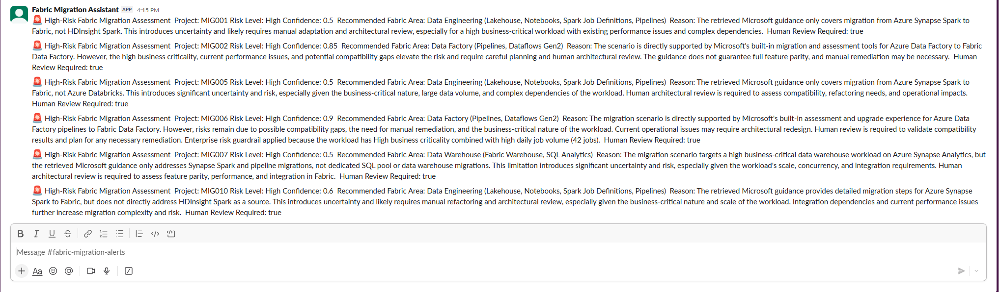
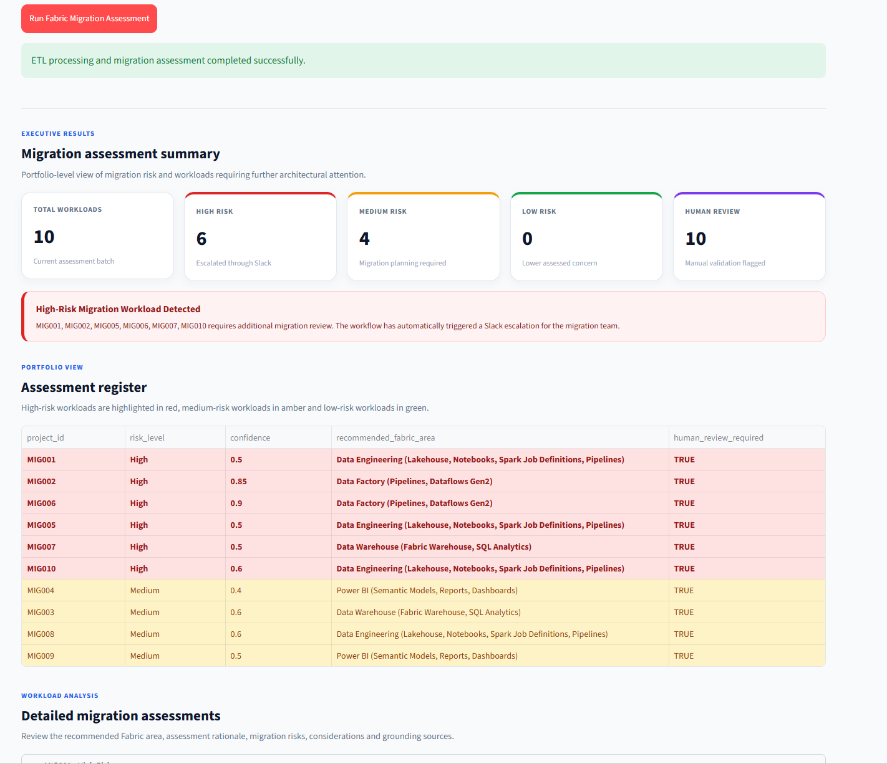

# Testing and Results

## 1. Purpose

Testing was performed incrementally throughout the development of the AI-Powered Fabric Migration Assessment Platform.

The objective was to validate each layer independently before testing the complete end-to-end workflow.

The main areas tested were:

```text
Knowledge ingestion
FAISS vector store
RAG retrieval
GPT-4.1 assessment
Structured output validation
FastAPI
n8n ETL
n8n → FastAPI integration
Risk routing
Slack escalation
Webhook processing
Streamlit multi-file upload
Consolidated reporting
End-to-end automation
```

---

## 2. Testing Approach

The project followed an incremental testing approach:

```text
Component Test
      ↓
Integration Test
      ↓
Workflow Test
      ↓
End-to-End Test
```

Each component was validated before adding the next layer.

This made troubleshooting easier because failures could be isolated to a specific part of the architecture.

---

## 3. Knowledge Ingestion Test

Four official Microsoft Learn sources were ingested into the project knowledge base.

The processed documents included:

```text
ADF Migration Planning
ADF Migration Assessment
Synapse Spark Migration
ADF Migration Best Practices
```

The ingestion process successfully extracted and stored cleaned text from all four sources.

Approximate processed content sizes:

```text
ADF Migration Planning          12,122 characters
ADF Migration Assessment         3,854 characters
Synapse Spark Migration          4,992 characters
ADF Migration Best Practices     8,332 characters
```

Result:

```text
PASS
```

---

## 4. Encoding Issue and Resolution

During web ingestion, some Microsoft Learn text initially contained incorrect character encoding.

For example, punctuation such as:

```text
don’t
```

was not represented correctly.

The ingestion logic was updated to use the detected response encoding.

After the change, the processed knowledge files displayed the expected characters correctly.

Result:

```text
PASS
```

Key learning:

Web ingestion requires validation of both extracted content and character encoding.

---

## 5. FAISS Vector Store Test

The four processed Microsoft Learn documents were chunked and embedded.

Configuration:

```text
Chunk Size:       1000
Chunk Overlap:     150
Embedding Model:  text-embedding-3-small
Vector Store:     FAISS
```

The final vector store contained:

```text
41 chunks
```

The FAISS index was successfully persisted under:

```text
knowledge/faiss_index/
```

Result:

```text
PASS
```

---

## 6. Retrieval Test

A retrieval test was performed before connecting the vector store to GPT-4.1.

The test confirmed that migration-related questions returned relevant chunks from the Microsoft Learn knowledge base.

This validated the flow:

```text
User / Migration Query
        ↓
OpenAI Embedding
        ↓
FAISS Similarity Search
        ↓
Relevant Knowledge Chunks
```

Result:

```text
PASS
```

---

## 7. Initial RAG Assessment Test

A sample HDInsight Spark migration workload was assessed.

Example:

```text
Project:              MIG001
Application:          Sales Analytics
Source Platform:      HDInsight
Workload Type:        Spark
Data Size:            850 GB
Daily Jobs:           24
Business Criticality: High
Target:               Microsoft Fabric
```

The RAG pipeline retrieved Microsoft migration guidance and supplied the context together with the migration scenario to GPT-4.1.

An early assessment returned approximately:

```text
Recommended Fabric Area:
Data Engineering
(Lakehouse, Notebooks, Spark Job Definitions, Pipelines)

Risk Level:
Medium

Confidence:
0.7

Human Review Required:
True
```

The model also identified that the retrieved documentation was more directly related to Synapse Spark migration than HDInsight-specific migration.

This was considered useful behavior because the assessment did not hide the limitation of the retrieved context.

Result:

```text
PASS
```

---

## 8. Structured Output Validation Test

The GPT assessment was required to return the following structured fields:

```text
project_id
recommended_fabric_area
risk_level
confidence
key_risks
migration_considerations
human_review_required
reason
sources_used
```

Validation rules included:

```text
Required fields must exist

risk_level must be:
Low
Medium
High

confidence must be between:
0.0 and 1.0

human_review_required must be:
Boolean
```

This prevents downstream automation from depending on uncontrolled natural-language output.

Result:

```text
PASS
```

---

## 9. Recommended Fabric Area Safeguard Test

During testing, GPT occasionally returned a missing or blank:

```text
recommended_fabric_area
```

A deterministic fallback was added.

The fallback only activates when the AI recommendation is blank or missing.

Example mappings:

```text
Reporting / Power BI
→ Power BI
  (Semantic Models, Reports, Dashboards)

Warehouse
→ Data Warehouse
  (Fabric Warehouse, SQL Analytics)

Spark / Databricks / HDInsight
→ Data Engineering
  (Lakehouse, Notebooks, Spark Job Definitions, Pipelines)

ADF / Pipeline / ETL
→ Data Factory
  (Pipelines, Dataflows Gen2)
```

After implementation, assessment records consistently contained a Fabric-area recommendation.

Result:

```text
PASS
```

---

## 10. FastAPI Health Test

FastAPI was started locally using:

```text
uvicorn app.api:app --reload
```

The health endpoint was tested:

```text
GET /
```

The API successfully returned its running status.

Swagger documentation was also available through:

```text
/docs
```

Result:

```text
PASS
```

---

## 11. FastAPI Assessment Endpoint Test

The assessment endpoint was tested using:

```text
POST /assess
```

A structured migration workload was submitted.

FastAPI successfully:

```text
Received migration scenario
        ↓
Created retrieval query
        ↓
Generated query embedding
        ↓
Retrieved FAISS context
        ↓
Called GPT-4.1
        ↓
Validated response
        ↓
Returned structured JSON
```

Result:

```text
PASS
```

---

## 12. n8n ETL Test

Raw migration inventory data intentionally contained inconsistent values.

Examples:

```text
HD insight
azure data factory
power bi

HIGH
MEDIUM
low

ADF; adls
```

The n8n Code node successfully standardized the records.

Examples:

```text
HD insight
→ HDInsight

azure data factory
→ Azure Data Factory

power bi
→ Power BI

HIGH
→ High

low
→ Low

ADF; adls
→ ["ADF", "ADLS"]
```

Numeric fields were also converted to the appropriate types.

Result:

```text
PASS
```

---

## 13. n8n → FastAPI Integration Test

n8n runs on a Hostinger VPS while FastAPI runs locally during development.

A temporary Cloudflare tunnel was used to connect them.

Test path:

```text
n8n
 ↓
Cloudflare Tunnel
 ↓
FastAPI
 ↓
RAG Pipeline
 ↓
Structured Response
 ↓
n8n
```

The HTTP Request node successfully received assessment results from FastAPI.

Result:

```text
PASS
```

---

## 14. Cloudflare Tunnel Failure Test

During development, an existing temporary Cloudflare endpoint became unreachable.

The n8n HTTP Request failed to connect to FastAPI.

Cause:

```text
Temporary Cloudflare tunnel expired / became unavailable
```

Resolution:

```text
Restart Cloudflare tunnel
        ↓
Receive new temporary URL
        ↓
Update n8n HTTP Request endpoint
        ↓
Retest
```

The integration succeeded after the update.

Result:

```text
ISSUE RESOLVED
```

Key learning:

Temporary tunnels are suitable for development but should not be used as permanent production connectivity.

---

## 15. Multi-Record n8n Test

The migration inventory was expanded from a single test record to multiple CSV records.

The workflow successfully processed all rows individually.

Conceptually:

```text
CSV
 ↓
Extract Rows
 ↓
ETL
 ↓
Workload 1 → FastAPI
Workload 2 → FastAPI
Workload 3 → FastAPI
...
```

This confirmed that the workflow was not restricted to MIG001.

Result:

```text
PASS
```

---

## 16. Slack Integration Test

Slack was connected to the High-risk branch of the n8n workflow.

Initial error:

```text
not_in_channel
```

Cause:

The n8n Slack application had not joined the selected Slack channel.

Resolution:

The application was added to:

```text
#fabric-migration-alerts
```

After this change, Slack alerts were successfully delivered.

Result:

```text
PASS
```

---

## 17. Risk Routing Test

### Slack High-Risk Escalation



*Figure: High-risk migration workloads automatically escalated by n8n to the `#fabric-migration-alerts` Slack channel after the final assessment and deterministic enterprise risk evaluation.*


The n8n IF node evaluates:

```text
risk_level == High
```

Both routing behaviors were validated:

```text
High
→ True branch
→ Slack

Medium / Low
→ False branch
→ No High-risk Slack alert
```

Result:

```text
PASS
```

---

## 18. LLM Variability Observed

During repeated assessment testing, GPT-4.1 did not always return exactly the same risk classification for identical or similar workloads.

This occurred even with:

```text
temperature = 0
```

Example behavior observed during development:

```text
One execution → High
Another execution → Medium
```

This is expected because temperature zero reduces randomness but does not make an LLM a deterministic business rules engine.

This became an important architectural learning from the project.

---

## 19. Enterprise Risk Guardrail Test

To provide predictable operational escalation, a deterministic enterprise risk guardrail was added after the AI assessment.

Current rule:

```text
Business Criticality = High

AND

at least one:

Data Size >= 1000 GB
OR
Daily Jobs >= 40
OR
Dependency Count >= 3

        ↓

Final Risk = High
```

If the AI already returns High, the classification remains High.

If the AI returns a lower classification but the enterprise rule is triggered, the final classification is raised to High.

Human review is also required.

The assessment reason records that the enterprise guardrail was applied.

Result:

```text
PASS
```

---

## 20. Webhook Test

The n8n workflow was converted from a Manual Trigger to a Webhook-triggered application workflow.

The webhook successfully received CSV data submitted from outside the n8n editor.

Path:

```text
POST
/webhook/fabric-migration-assessment
```

Result:

```text
PASS
```

---

## 21. Binary CSV Extraction Test

The uploaded CSV arrived at n8n as binary data.

The binary property was observed as:

```text
file0
```

Extract from File was configured to read this property.

An unexpected parsing shape was encountered where a CSV row appeared as a single comma-delimited field.

The Code node was enhanced to parse this structure, including quoted CSV values.

After parsing, the expected structured migration records were produced.

Result:

```text
PASS
```

---

## 22. Webhook Response Test

Initially, the webhook returned:

```json
{
  "message": "Workflow was started"
}
```

instead of the final assessment CSV.

The workflow was changed to:

```text
Convert to File
       ↓
Respond to Webhook
```

The webhook then successfully returned the completed assessment as binary CSV data.

Result:

```text
PASS
```

---

## 23. Streamlit UI Test

The Streamlit application was tested locally.

The UI successfully provided:

```text
Multi-file CSV upload
Schema validation
Input preview
Workload metrics
Assessment execution
Executive risk metrics
Color-coded assessment register
Detailed workload assessments
Source information
CSV download
```

Result:

```text
PASS
```

---

## 24. Multi-File Upload Test

### Final Streamlit Assessment Results



*Figure: Final end-to-end assessment of 10 migration workloads. The workflow completed ETL and AI assessment successfully, producing 6 High-risk and 4 Medium-risk workloads, with all 10 flagged for human review. High-risk workloads were automatically escalated through Slack.*

Two migration inventory CSV files were uploaded simultaneously.

Observed UI metrics:

```text
Files Selected:       2
Valid Files:          2
Total Workloads:     10
Detected Columns:    10
```

Both files passed schema validation.

Streamlit successfully consolidated the files into one in-memory CSV before submitting them to n8n.

Result:

```text
PASS
```

---

## 25. Final End-to-End Test

The complete final architecture was tested using:

```text
2 CSV files
10 workloads
```

End-to-end path:

```text
User
 ↓
Streamlit
 ↓
2 CSV Files
 ↓
Validation
 ↓
Consolidation
 ↓
n8n Webhook
 ↓
Extract CSV
 ↓
ETL Cleaning
 ↓
10 Structured Workloads
 ↓
FastAPI
 ↓
OpenAI Embeddings
 ↓
FAISS Retrieval
 ↓
GPT-4.1
 ↓
Validation
 ↓
Fabric Area Safeguard
 ↓
Enterprise Risk Guardrail
 ↓
Final Assessments
 ↓
n8n Risk Routing
 ↓
Slack Escalation
 ↓
Consolidated CSV
 ↓
Streamlit Results
```

Final observed result:

```text
Total Workloads: 10
High Risk:        6
Medium Risk:      4
Low Risk:         0
Human Review:    10
```

High-risk projects:

```text
MIG001
MIG002
MIG005
MIG006
MIG007
MIG010
```

All six High-risk workloads were successfully routed to Slack.

Result:

```text
PASS
```

---

## 26. Final Assessment Register

The final tested batch produced approximately:

| Project | Final Risk | Confidence | Recommended Fabric Area |
|---|---|---:|---|
| MIG001 | High | 0.5 | Data Engineering |
| MIG002 | High | 0.9 | Data Factory |
| MIG003 | Medium | 0.6 | Data Warehouse |
| MIG004 | Medium | 0.5 | Power BI |
| MIG005 | High | 0.5 | Data Engineering |
| MIG006 | High | 0.9 | Data Factory |
| MIG007 | High | 0.5 | Data Warehouse |
| MIG008 | Medium | 0.6 | Data Engineering |
| MIG009 | Medium | 0.5 | Power BI |
| MIG010 | High | 0.6 | Data Engineering |

All 10 assessments required human review.

Important:

These risk values represent the **final assessment after AI reasoning and deterministic enterprise guardrails**.

They should not be interpreted as classifications produced solely by GPT-4.1.

---

## 27. Slack Escalation Validation

The six High-risk projects:

```text
MIG001
MIG002
MIG005
MIG006
MIG007
MIG010
```

were confirmed in the Slack channel:

```text
#fabric-migration-alerts
```

This validated:

```text
Final Risk Classification
        ↓
n8n IF Node
        ↓
High
        ↓
Slack
```

Observed:

```text
Expected High-Risk Alerts: 6
Slack Alerts Received:     6
```

Result:

```text
PASS
```

---

## 28. End-to-End Automation Validation

The final test confirmed that after the user initiates an assessment from Streamlit, no manual processing is required.

Automated stages:

```text
Consolidation
ETL
Standardization
API Calls
Embedding
Retrieval
AI Assessment
Validation
Reliability Safeguards
Risk Guardrail
Risk Routing
Slack Notification
CSV Generation
Webhook Response
UI Reporting
```

Therefore, the solution is accurately described as:

> A human-triggered, end-to-end automated AI migration assessment workflow.

---

## 29. Known Limitations Identified During Testing

Testing also identified limitations that would need to be addressed for production use.

### Temporary FastAPI Connectivity

FastAPI currently runs locally and is exposed to n8n through a temporary Cloudflare tunnel.

Production should use persistent hosting.

### Webhook Security

The current demonstration webhook does not implement production-grade authentication.

### LLM Variability

GPT assessments can vary between executions.

Deterministic guardrails reduce operational impact but do not make the entire AI assessment deterministic.

### Knowledge Coverage

The RAG knowledge base currently contains selected Microsoft Learn documentation focused mainly on:

```text
ADF migration
Synapse Spark migration
Fabric migration guidance
```

It is not a comprehensive migration knowledge base for every supported source platform.

### Human Review

All final demonstration workloads required human review.

The platform should therefore be treated as an assessment assistant rather than an autonomous migration decision authority.

### Duplicate Slack Alerts

Re-running the same assessment can generate another Slack message for the same High-risk workload.

A production system should implement idempotency or duplicate suppression.

---

## 30. Final Test Summary

| Test Area | Result |
|---|---|
| Microsoft Learn ingestion | PASS |
| Character encoding | PASS |
| Chunking and embeddings | PASS |
| FAISS vector store | PASS |
| Retrieval | PASS |
| GPT-4.1 assessment | PASS |
| Structured output validation | PASS |
| Fabric-area safeguard | PASS |
| FastAPI health endpoint | PASS |
| FastAPI assessment endpoint | PASS |
| n8n ETL | PASS |
| n8n → FastAPI integration | PASS |
| Multi-record processing | PASS |
| Risk routing | PASS |
| Enterprise risk guardrail | PASS |
| Slack integration | PASS |
| Webhook trigger | PASS |
| Binary CSV extraction | PASS |
| Webhook CSV response | PASS |
| Streamlit UI | PASS |
| Multi-file upload | PASS |
| 10-workload assessment | PASS |
| 6 High-risk Slack alerts | PASS |
| End-to-end automation | PASS |

---

## 31. Final Testing Status

```text
COMPONENT TESTING       COMPLETE
INTEGRATION TESTING     COMPLETE
WORKFLOW TESTING        COMPLETE
MULTI-FILE TESTING      COMPLETE
END-TO-END TESTING      COMPLETE
SLACK VALIDATION        COMPLETE
```

The functional scope of the Week 3 AI-Powered Fabric Migration Assessment Platform has been successfully validated.